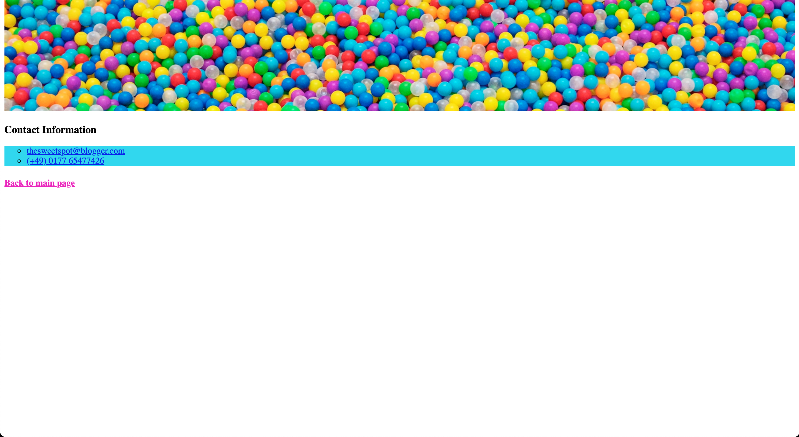

# The Sweet Spot v2

Wir wollen unsere vorherige Übung verbessern, indem wir einige Bilder hinzufügen. Siehe die neue und verbesserte Seite [here](https://digitalcareerinstitute.github.io/UIB-content-the-sweet-spot-v2/index.html)

#### Hauptseite

#### Kontakt Seite

### Anweisungen

> - Alle Bilder, die wir verwenden, befinden sich im Ordner `images`.
> - Die Bilder `contact-header.jpeg` und `main-header.jpg` sollten oben auf der Seite _contact_ bzw. _header_ eingefügt werden.
> - Die Bilder im Abschnitt _Our Treats_ (`candy-floss.jpg`, `jellybeans.jpg`, `lollipop.jpg`) müssen neben dem Text mit einem `border-radius` und `border` versehen werden
> - Jedes Bild sollte mit der Wikiseite für das jeweilige Thema verlinkt sein. Wenn der Benutzer z.B. auf das Bild _Lollipop_ klickt, sollte er auf die Wikipedia-Seite für **Lollipop** gehen
> - Wir können wieder http://www.cupcakeipsum.com/ für den Blindtext im Abschnitt _Our Treats_ verwenden
> - Klassen, IDs und CSS-Selektoren sollten verwendet werden, wo es angebracht ist
> - Wie immer solltest du versuchen, deine Webseite so pixelgenau wie möglich zu gestalten.
